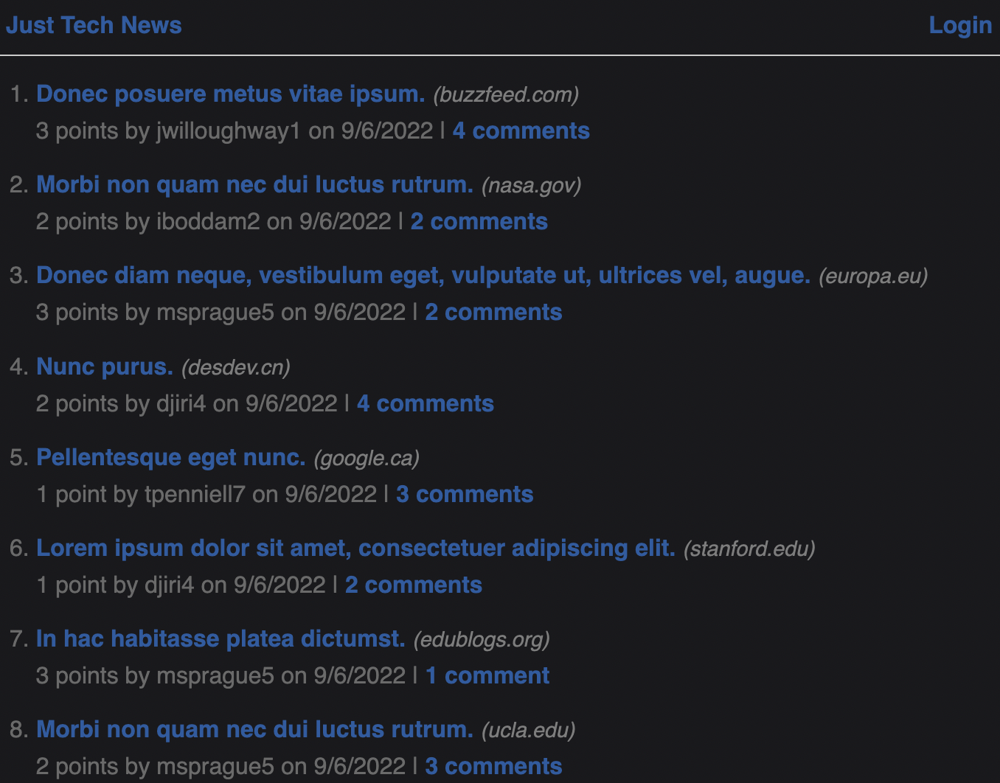

# Just tech news

Just Tech News: Tech news website where users can post, upvote, and comment on links to news articles.

## Usage

- Bcrypt
- Connect-session-sequelize
- Dotenv
- Express
- Express-handlebars
- Express-session
- Mysql2
- Sequelize
- Deployed on Heroku / Plugin: JawsDB MySQL

## Link to heroku deplyment
[Heroku link depolyed here](https://just-tech-newbie.herokuapp.com/)

## Screenshot

## Author & Contact Info
Boyd Roberts

[Coleyrockin Github](https://github.com/coleyrockin)

[Coleyrockin@aol.com](mailto:coleyrockin@aol.com)
