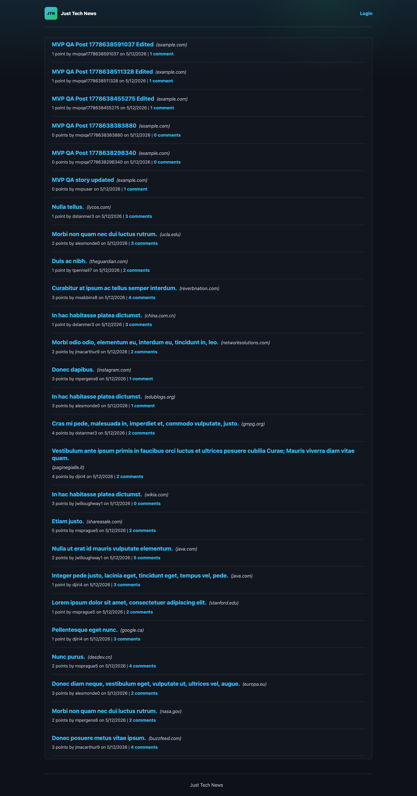
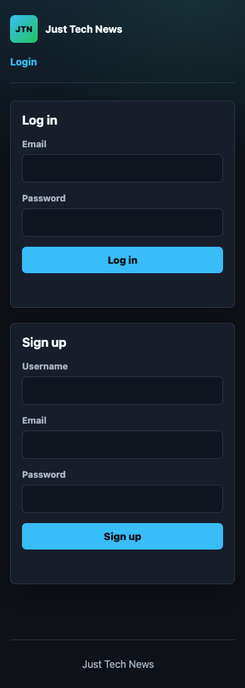

# Just Tech News


Just Tech News is a full-stack tech-news sharing app built with Express, Handlebars, Sequelize, and MySQL. Users can create an account, publish links, discuss posts, and upvote stories in a focused Hacker News-style workflow.

Live deployment: [https://just-tech-news.vercel.app](https://just-tech-news.vercel.app)

## Screenshots





## What It Does

- Lets users sign up, log in, and keep an authenticated session.
- Lets authenticated users create, edit, and delete their own posts.
- Lets authenticated users comment on posts and upvote each post once.
- Shows public post lists, post detail pages, comment threads, and ownership-aware dashboard controls.
- Runs locally with a traditional Express server and can deploy through Vercel or Netlify serverless adapters.

## MVP Features

- Secure password hashing with `bcryptjs`
- Session storage through MySQL-backed `connect-session-sequelize`
- Owner-only post, comment, and account mutations
- One vote per user per post
- Inline form errors and loading states
- Responsive dark UI for desktop, tablet, and mobile
- Public API responses that avoid exposing user email addresses
- Health check endpoint at `GET /healthz`
- CI-ready lint, unit tests, and npm audit commands

## Tech Stack

| Area       | Tooling                                                 |
| ---------- | ------------------------------------------------------- |
| Server     | Node.js 20+, Express 4                                  |
| Views      | Express Handlebars 6                                    |
| Data       | MySQL 8+, Sequelize 6, mysql2                           |
| Auth       | express-session, connect-session-sequelize, bcryptjs    |
| Serverless | Vercel Node handler, Netlify Functions, serverless-http |
| Quality    | Jest 30, ESLint 9, Prettier 3, GitHub Actions           |

## Local Setup

```bash
git clone https://github.com/coleyrockin/just-tech-news.git
cd just-tech-news
npm install
cp .env.example .env
```

Create the database and seed it:

```bash
mysql -u root -p < db/schema.sql
npm run seeds
```

Start the app:

```bash
npm start
```

Default local URL: [http://localhost:3001](http://localhost:3001)

## Environment Variables

Copy `.env.example` to `.env` and fill in local values. `.env` is intentionally ignored and must never be committed.

| Variable         | Required            | Notes                                                         |
| ---------------- | ------------------- | ------------------------------------------------------------- |
| `SESSION_SECRET` | Production          | Required when `NODE_ENV=production`; use a long random value. |
| `DATABASE_URL`   | Production          | Preferred hosted MySQL connection string.                     |
| `JAWSDB_URL`     | Production fallback | Supported for Heroku/JawsDB-style deployments.                |
| `DB_NAME`        | Local               | Defaults to `just_tech_news_db`.                              |
| `DB_USER`        | Local               | MySQL user for local development.                             |
| `DB_PASSWORD`    | Local               | MySQL password for local development.                         |
| `DB_HOST`        | Local optional      | Defaults to `localhost`.                                      |
| `DB_PORT`        | Local optional      | Defaults to `3306`.                                           |
| `DB_SSL`         | Hosted DB dependent | Set to `true` when the hosted MySQL provider requires SSL.    |
| `PORT`           | Local optional      | Defaults to `3001`.                                           |

## Scripts

| Command                          | Purpose                               |
| -------------------------------- | ------------------------------------- |
| `npm start`                      | Start the local Express server.       |
| `npm run seeds`                  | Reset and seed database tables.       |
| `npm test`                       | Run Jest tests.                       |
| `npm run lint`                   | Run ESLint.                           |
| `npm run check`                  | Run lint and tests.                   |
| `npm run format`                 | Format supported files with Prettier. |
| `npm run deploy:preview`         | Deploy a Vercel preview.              |
| `npm run deploy:prod`            | Deploy to Vercel production.          |
| `npm run netlify:dev`            | Run Netlify's local dev server.       |
| `npm run netlify:deploy:preview` | Deploy a Netlify preview.             |
| `npm run netlify:deploy:prod`    | Deploy to Netlify production.         |

## Testing And Validation

Run before pushing:

```bash
npm run check
npm audit
npm audit --omit=dev
```

For release QA, also verify the DB-backed browser flow:

1. Load schema and seed data.
2. Start `npm start`.
3. Verify signup, login, create post, edit post, comment, upvote, delete post, logout, protected-route redirect, and `/healthz`.
4. Check desktop, tablet, and mobile layouts for overflow, cramped controls, and broken visual states.

## Deployment Notes

The app has three runtime entry points:

- `server.js` for local Node/Express.
- `api/index.js` for Vercel's Node request/response runtime.
- `netlify/functions/server.js` for Netlify Functions through `serverless-http`.

The Vercel project is wired for the app code and routes, but hosted database-backed routes require production environment variables to be configured in Vercel. At minimum, set:

```text
SESSION_SECRET
DATABASE_URL or JAWSDB_URL
DB_SSL=true if required by the hosted MySQL provider
```

## Roadmap

Shipped in the MVP:

- Full account/session flow
- Link posting and owner dashboard
- Comments and one-vote-per-user upvotes
- Responsive dark UI with inline form feedback
- Serverless-ready Express runtime
- Lint, tests, dependency audits, and CI workflow

Future improvements:

- Add password reset and email verification
- Add pagination and sorting for large post lists
- Add user profile pages with public contribution history
- Add end-to-end browser tests in CI
- Add admin moderation tools for spam or broken links

## Known Limitations

- Hosted Vercel routes need production MySQL/session environment variables before the live deployment is fully usable.
- The app uses server-rendered Handlebars and light browser JavaScript; there is no client-side SPA state layer.
- Seed content is demo data for local QA, not editorial production content.

## Security Notes

- `.env`, `.netlify`, `.vercel`, and `node_modules` are ignored.
- Passwords are hashed with bcrypt before storage.
- Production requires `SESSION_SECRET`.
- Session cookies are `httpOnly`, `sameSite=lax`, and secure in production.
- Public user endpoints avoid returning email addresses.
- External post links use `rel="noopener noreferrer"`.

## Credits

Built by Boyd Roberts as a full-stack MVP project.

## License

ISC
