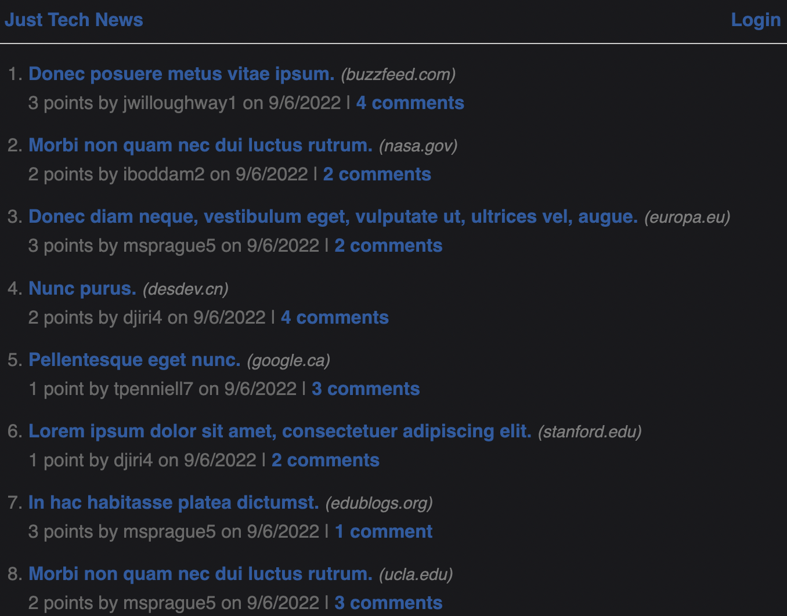

# Just Tech News


## About

A tech news website where users can post, upvote, and comment on links to news articles. Built with Express, Handlebars, and Sequelize following the MVC architecture pattern. Deployable as Netlify Functions via serverless-http.

## Features

- User signup and login with session-based authentication
- Create, edit, and delete tech news posts
- Upvote posts from other users
- Comment on posts
- User dashboard for managing your own posts
- Handlebars server-side rendering
- Netlify Functions serverless deployment
- Database seeding with sample data

## Tech Stack

| Layer | Technology |
|-------|------------|
| Server | Node.js, Express.js 4 |
| Templating | Express Handlebars 6 |
| Database | MySQL, Sequelize 6, mysql2 2 |
| Auth | bcryptjs 2, express-session 1, connect-session-sequelize 7 |
| Deployment | Netlify Functions, serverless-http 3 |
| Config | dotenv 16 |
| Testing | Jest 30 |

## Getting Started

```bash
# Clone the repository
git clone https://github.com/coleyrockin/just-tech-news.git
cd just-tech-news

# Install dependencies
npm install

# Create the database
mysql -u <user> -p < db/schema.sql

# Configure environment variables
cp .env.example .env

# Seed test data (optional)
npm run seeds

# Start the application
npm start
```

The app runs at `http://localhost:3001` by default.

## Project Structure

```
just-tech-news/
├── __tests__/
├── config/
├── controllers/
├── db/
├── models/
├── netlify/
│   └── functions/
├── public/
├── seeds/
├── utils/
├── views/
├── app.js
├── server.js
├── netlify.toml
└── package.json
```

---

> Built by [coleyrockin](https://github.com/coleyrockin)# Just Tech News

Just Tech News is a tech news website where users can post, upvote, and comment on links to news articles.

## Architecture

- Backend: Express + Handlebars + Sequelize
- Sessions: `express-session` + `connect-session-sequelize`
- Database: MySQL (`DATABASE_URL` preferred, `JAWSDB_URL` supported)
- Deployment: Netlify Functions (`serverless-http` wrapping Express)

## Environment Variables

Copy `.env.example` to `.env` for local development.

| Variable | Required | Description |
| --- | --- | --- |
| `SESSION_SECRET` | Yes | Session signing secret. Must be set in production. |
| `DATABASE_URL` | Recommended | Full MySQL connection URL for production. |
| `JAWSDB_URL` | Optional | Backward-compatible DB URL fallback. |
| `DB_NAME` | Local fallback | Local database name (used if URL vars are not set). |
| `DB_USER` | Local fallback | Local database user. |
| `DB_PASSWORD` | Local fallback | Local database password. |
| `DB_HOST` | Optional | Local DB host, defaults to `localhost`. |
| `DB_PORT` | Optional | Local DB port, defaults to `3306`. |
| `DB_SSL` | Optional | Set to `true` to enable MySQL SSL/TLS. |
| `PORT` | Optional | Local Express port, defaults to `3001`. |

## Local Development

1. Install dependencies:
   ```bash
   npm install
   ```
2. Create DB and schema:
   ```bash
   mysql -u <user> -p < db/schema.sql
   ```
3. Configure `.env`.
4. (Optional) Seed test data:
   ```bash
   npm run seeds
   ```
5. Start app:
   ```bash
   npm start
   ```

## Testing

Run helper unit tests:

```bash
npm test
```

## Netlify Deployment

### 1) Link or create a Netlify site

```bash
npx netlify init
```

### 2) Set required environment variables in Netlify

```bash
npx netlify env:set SESSION_SECRET "<secure-random-secret>"
npx netlify env:set DATABASE_URL "<mysql-connection-url>"
npx netlify env:set DB_SSL "true" # only if your provider requires SSL
```

If you are using `JAWSDB_URL` instead of `DATABASE_URL`, set that key in Netlify instead.

### 3) Preview deploy

```bash
npm run deploy:preview
```

### 4) Production deploy

```bash
npm run deploy:prod
```

## Verification Checklist

- Homepage renders and static assets load.
- Signup/login/logout works.
- Create/edit/delete posts works from dashboard.
- Upvote and comments persist in DB.
- API routes return expected payloads/statuses.
- Netlify function logs show no runtime errors.

## Troubleshooting

- `SESSION_SECRET must be set in production`:
  - Add `SESSION_SECRET` in Netlify environment variables.
- DB connection errors:
  - Verify `DATABASE_URL` (or `JAWSDB_URL`) is correct.
  - If provider requires TLS, set `DB_SSL=true`.
- Netlify function cannot find templates/assets:
  - Ensure `netlify.toml` includes `views/**` and `public/**` in `included_files`.

## Screenshot


